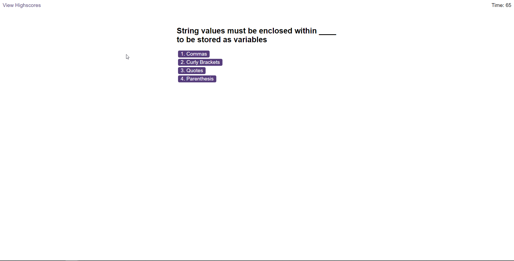
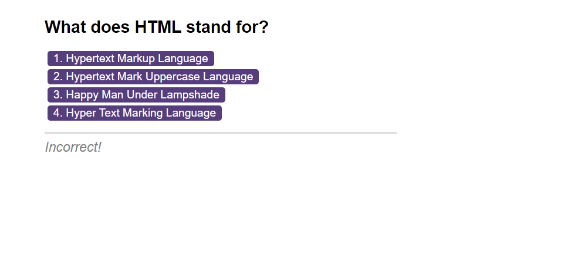
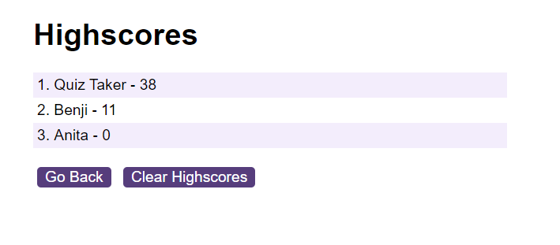

# Multiple Choice Quiz

Multiple choice interactive quiz with Javascript.

## Description

The motivation for building this project was to provide an interactive and fun way for people to test their coding knowledge within the browser. This is a good way to make studying exciting, engaging and interactive and solves the problem of helping students who are struggling to remember a lot of information about coding. This was also an excellent way for me to learn more about JavaScript, refreshing my knowledge of DOM manipulation as well as utilising arrays to store the question information and utilising and executing functions where needed. I also learnt how to use event listeners to create interactivity when the user does something such as clicking on a button on the page.

## Installation

N/A

## Usage

In order to use the quiz please open the application in your browser and press the 'start quiz' button to begin taking the quiz.

After pressing start, the quiz should begin and the timer will start. You can click on the buttons to input your guess for each question. The browser will show "incorrect" or "correct" depending on if you get the question right or not.

Quiz showing incorrect answer:

After completing the questions or the timer running out, you will gain a score based on how quickly and how well you were able to correctly answer the questions.
You can input your name or initials to have your score saved, and you can clear the saved scores by pressing "clear highscores".

Link to deployed application:

Link to repository on gitHub:

https://github.com/PsychicSalad/Multiple-Choice-Quiz

## License

This project uses an MIT license. For more information please view the license file in the repository.
